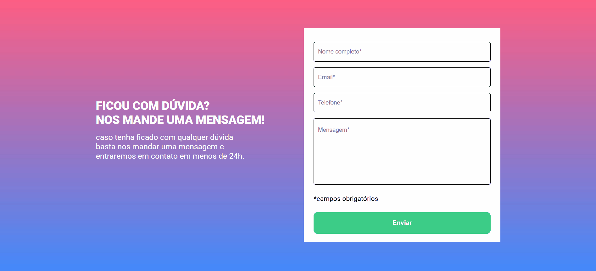
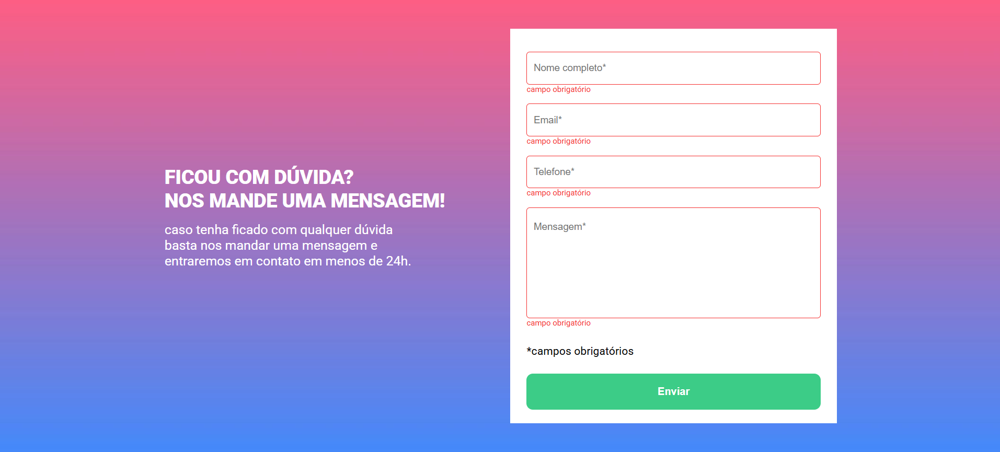
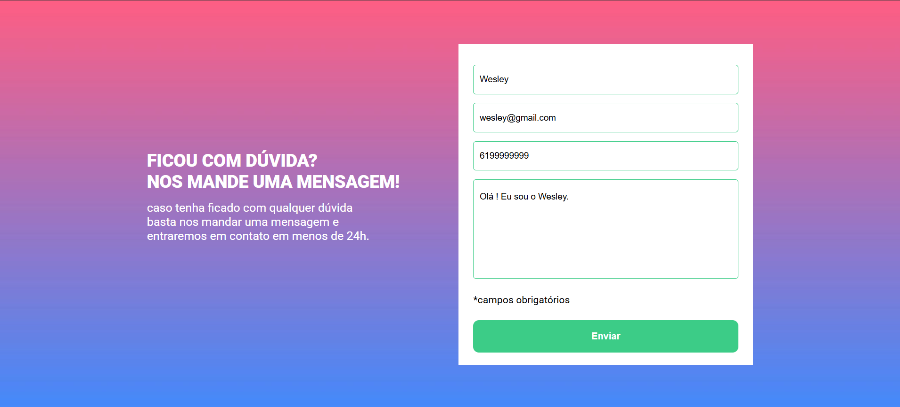

# Quest - Formulário com validação

<h3 >Prévia</h3>

Este é um projeto de um formulário com validação total em JavaScript, criado como um exercício ministrado pelo curso DevQuest Dev em Dobro ajudando a melhorar ainda mais meu conhecimento, escrita de código e semântica na programação !

## Tecnologia utilizada

<figure style=" display: flex; justify-content: space-around; text-align:center; align-items: center;">
        

## Objetivo

Este projeto tem como objetivo fazer a validação dos dados de um formulário, mas principalmente aprimorar e testar as habilidades com a lógica de programação.

- Criando o projeto com HTML e CSS para deixar a interface mais atraente para o usuário.

- Realizando a validação com JS e testando a lógica de programação.

### Etapas:

- Parte inicial do projeto

 

- Se o usuário não digitar em nenhum campo, ou deixar algum campo sem digitar, o campo sem informação ficará em vermelho e aparecerá uma frase abaixo com a informação: "campo obrigatório".

 

- Ao digitar todos os campos ou os que tiverem com a informação, o campo ficará verde, o que significa que está correto.

 

## Desafio

A validação no JavaScrip foi o que me desafiou bastante, o momento de criar a lógica por trás da validação, ao campo que for preenchido ou não tendo que aparecer cada cor específica de validado ou erro e a frase abaixo. Mas com persistencia e um pouco de pesquisa na internet, nos meus resumos dos estudos e revendo as aulas do DevQuest Dev em Dobro consegui resolver esse desafio.
 